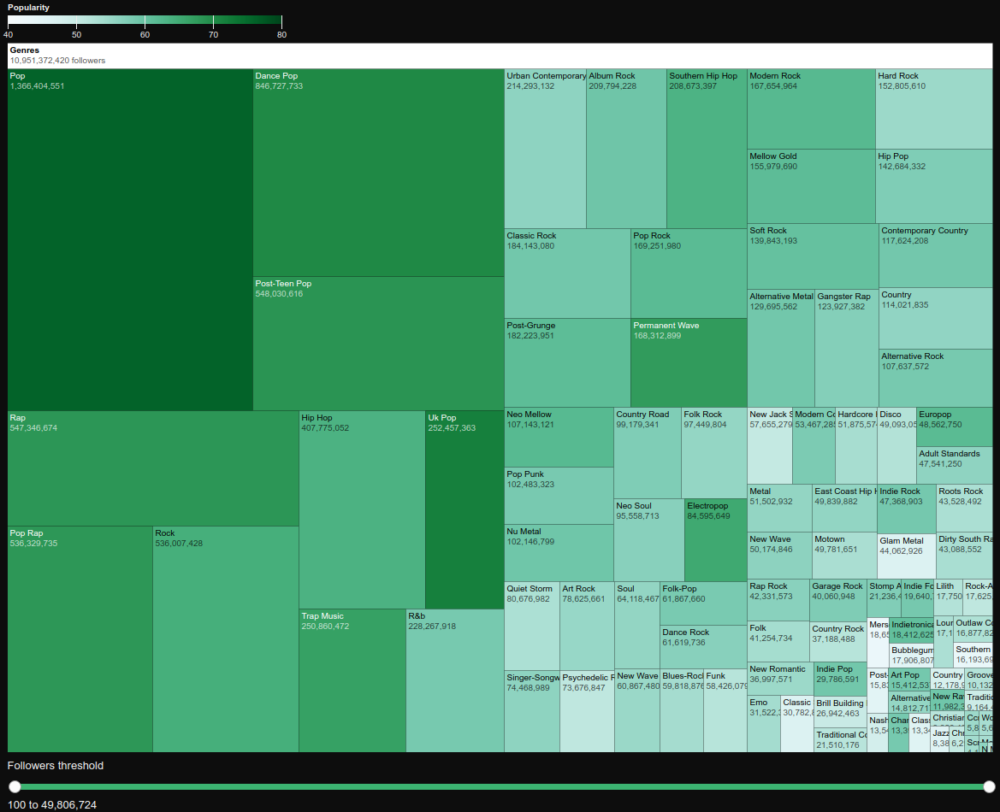
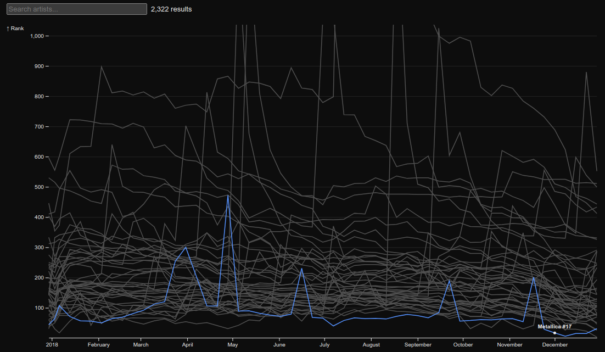
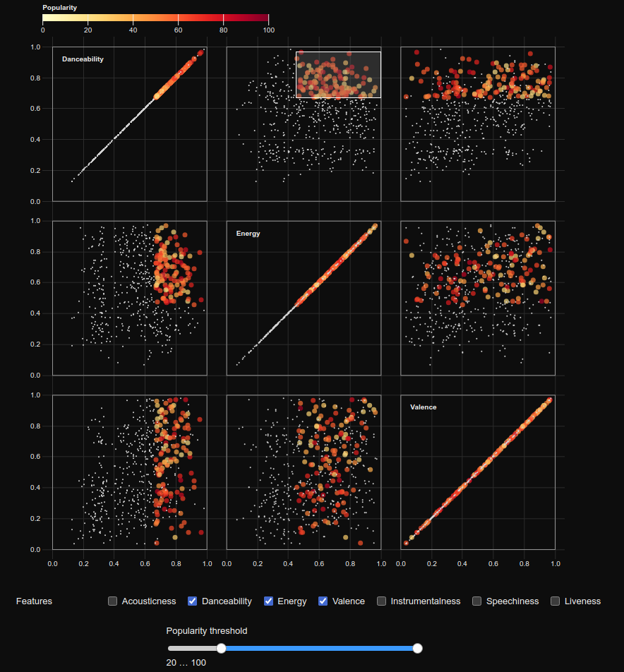
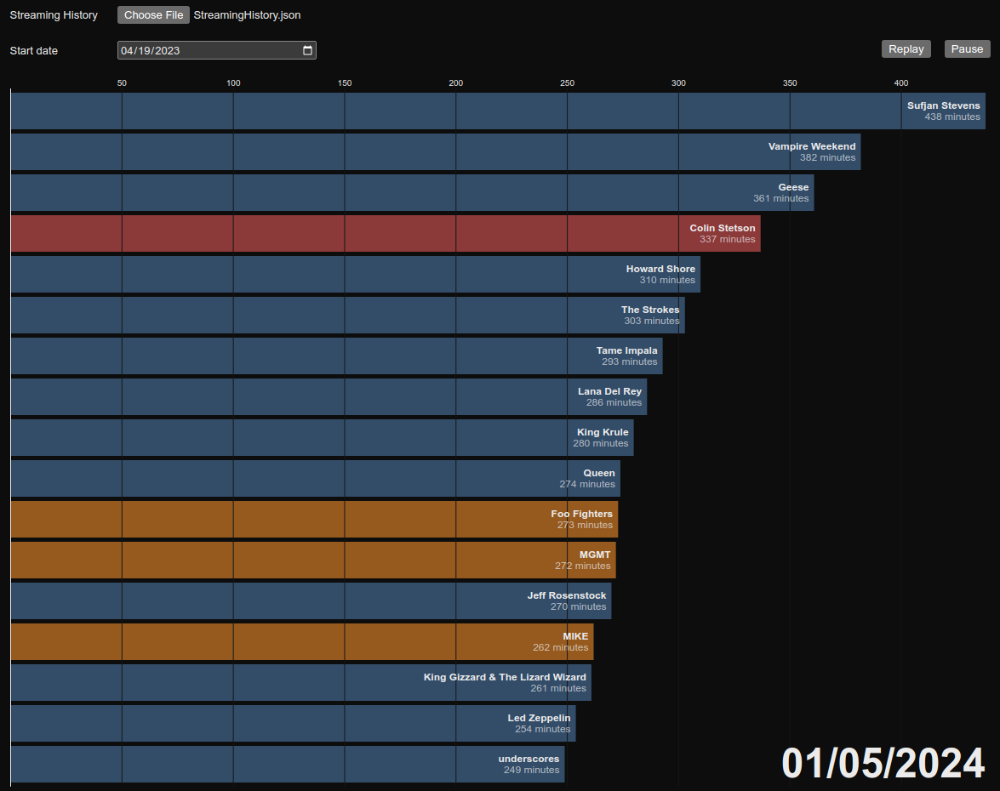

# Spotify Data Visualization

This project contains data visualizations of a Spotify dataset created mainly using Observable Framework and D3. These interactive visualizations can be accessed at: https://garcialnk.observablehq.cloud/visual-analytics






## Building

```
uv venv
source .venv/bin/activate
uv pip install -r requirements.txt

pnpm install
pnpm dev
```
